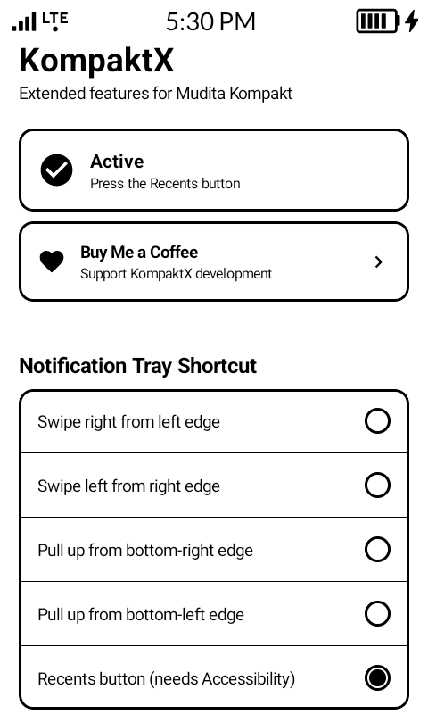
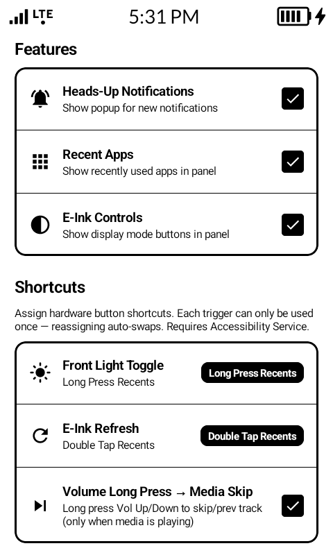
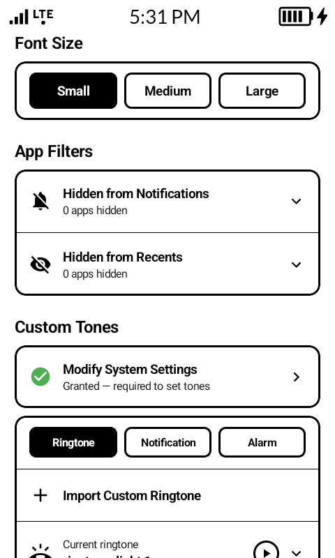
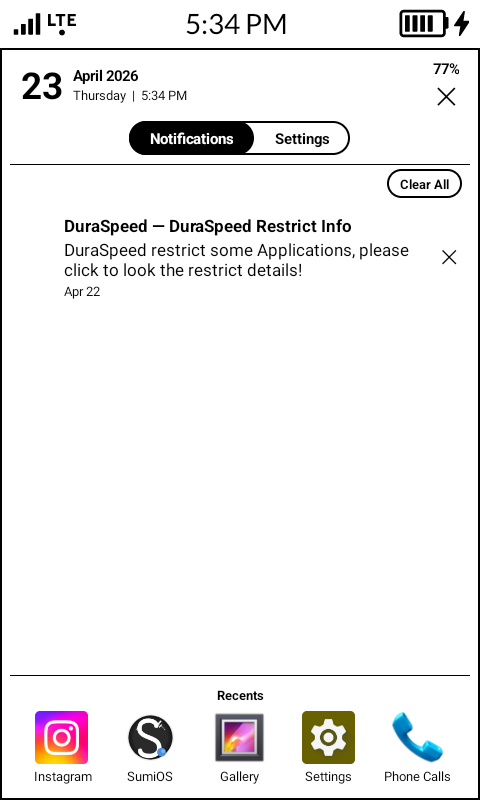
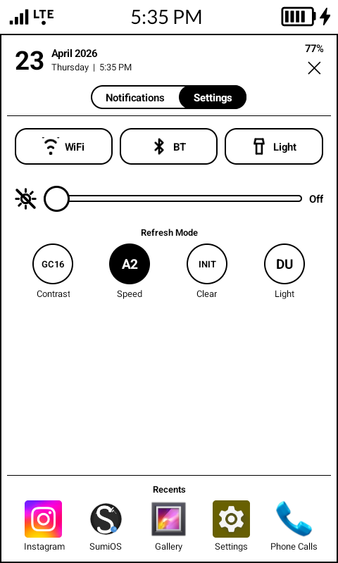
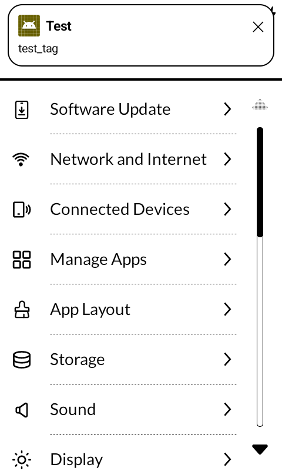

# KompaktX

**Extended feature overlay for the Mudita Kompakt**

> Restore the missing pieces of stock Android — built for the Mudita Kompakt.  
> KompaktX adds a notification tray, heads-up popups, shortcut remapping, brightness control, eink mode switching, and custom tones.

---

## 💖 Support the Project

If KompaktX makes your Mudita Kompakt more usable as a daily driver, consider supporting development:

  

---

## 🔍 Background

The Mudita Kompakt is a minimalist eink Android phone, but it ships without a notification shade, heads-up notifications, and several features many Android users expect.

KompaktX fills in those gaps with an overlay layer designed specifically for the Kompakt.

---

## ✅ What KompaktX Does

KompaktX adds a practical, eink-friendly feature layer on top of the stock Mudita Kompakt experience.

### Feature Summary

- **notification tray** with multiple trigger modes
- **Heads-up popups (banner)** for incoming notifications
- **Inline replies** and notification action buttons
- **In-tray quick settings** for Wi-Fi, Bluetooth, Torch, brightness, and eink modes
- **Recent apps row** with per-app hiding
- **Hardware shortcut remapping** for Recents and Back button gestures
- **Volume long press → media skip** when media is playing
- **Brightness control** with lockscreen-safe accessibility overlay behavior
- **Custom ringtone / notification / alarm tone import**
- **Overlay-wide font size presets**
- **Permission banner** that clears itself as setup is completed
- **Manual Refresh** for manually wiping ghosting from the eink panel

---

## 📸 Screenshots

  
  &nbsp;
  
  &nbsp;
  

  
  &nbsp;
  
  &nbsp;
  

---

## ✨ Features

### Notification Tray

- Ntification panel with five trigger modes:
  - Swipe from left edge
  - Swipe from right edge
  - Pull up from bottom-left
  - Pull up from bottom-right
  - Recents button
- Scrollable list grouped by app
- Tap to deep-link
- Swipe to dismiss
- Clear-all in one tap

### Heads-Up Notifications

- Popup notifications for incoming alerts
- Auto-dismiss after 5 seconds
- Swipe up to dismiss early
- Inline reply support for messages
- Action buttons such as **Reply** and **Mark as Read**

### Quick Settings

- Wi-Fi toggle
- Bluetooth toggle
- Torch toggle
- Brightness slider
- Sun-icon brightness toggle
- E-ink refresh modes:
  - Contrast (`GC16`)
  - Speed (`A2`)
  - Clear (`INIT`)
  - Light (`DU`)

### Media Widget

- Track info display
- Previous / Play-Pause / Next controls
- Auto-hides 30 seconds after playback stops

### Recent Apps Row

- Horizontal launcher integrated into the shade for recently used apps
- Tap to launch
- Long-press for system app info
- Hide individual apps from the row

### Hardware Shortcut Remapping

Assignable actions for:

- **Long Press Recents**
- **Double Tap Recents**
- **Long Press Back**

Available actions:

- Front Light Toggle
- Eink Refresh

Also includes:

- **Volume Long Press → Media Skip** when media is active

### Brightness Control

- Manual slider with live preview
- Front-light toggle remembers the last manual level
- Survives screen lock via accessibility overlay
- `ContentObserver` helps defend the chosen level from system overrides

### Custom Tones

- Import any audio file as:
  - Ringtone
  - Notification tone
  - Alarm tone
- Preview before selecting
- One-tap access to Modify System Settings permission

### Font Size

- Small
- Medium
- Large

Applied across the entire overlay UI.

### App Filters

- Hide individual apps from:
  - Notification list
  - Recent apps row

---

## 🔐 Permissions

| Permission | Purpose |
|---|---|
| Notification Listener | Read and manage notifications |
| Display Over Other Apps | Render the overlay panel and heads-up popups |
| Usage Access | Show recent apps |
| Accessibility Service | Hardware button interception, shortcut remapping, brightness overlay on lockscreen |
| Disable Battery Optimization | Keep the overlay service alive in the background |
| Modify System Settings | Set custom ringtones / notification tones |
| Read External Storage (≤ Android 12) | Import audio files |

KompaktX requests **no network permission** and makes **no network calls**.

---

### After install

1. Open **KompaktX**
2. Grant the permissions shown in the setup banner
3. The banner will shrink as each permission is granted
4. The overlay service starts automatically
5. Use your configured trigger to open the tray

---

## ⚖️ Disclaimer

KompaktX is provided **"AS IS"**

By installing or using KompaktX, you acknowledge that you understand its behavior and accept any potential risks, including:

- Unexpected bugs
- Minor device instability or permission interactions
- Possible incompatibility with future firmware or system updates

---

KompaktX is an independent project and is **not affiliated with, endorsed by, or sponsored by Mudita**.  
“Mudita” and “Mudita Kompakt” are trademarks of their respective owner.

---

## 📄 License

KompaktX is free software: you can redistribute it and/or modify it under the terms of the **GNU General Public License v2.0**.

See [LICENSE](LICENSE) for the full license text.

---

## ⭐ Support & Feedback

If KompaktX helped you:

- ⭐ Star the repository
- 🐞 Open an issue for bugs or device-specific behavior
- ☕ Support development via Buy Me a Coffee

---
